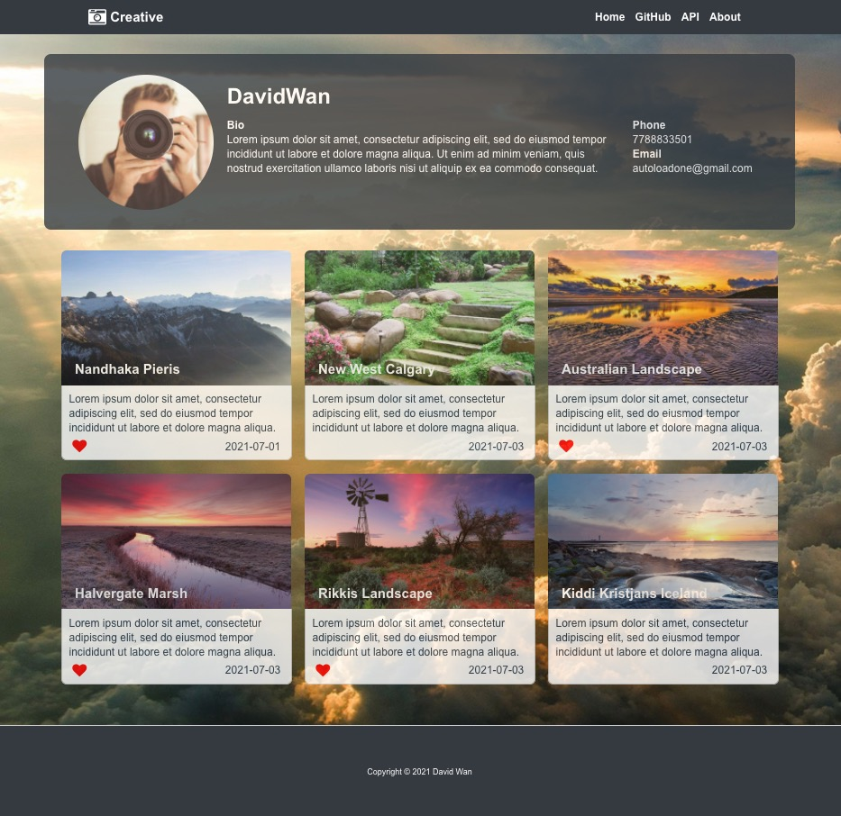

# creative-guild-test




This is a simple demonstration, Use Docker Compose to build LNMP development environment on AWS. Use Laravel and Vue to realize front and back end separation.


## Project Introduction
DEMO, a photographic artist gallery display system with separated front-end and back-end.


## Demand Analysis
- The personal display page of the photographer, displaying personal information and personal portfolio.
- Data needs to be persisted. The back-end provides RESTful API personal information and personal portfolio interfaces. The front-end needs to design the page and read the corresponding data to render the page.
- The front-end and back-end must be separated, and the front-end is processed asynchronously.


## Technology Selection
- The back-end framework specifies Laravel
- Separate the front end, consider fetching data, rendering data, and data binding to decide to use Vue
- The cloud server chooses AWS ES2, the Ubuntu system
- Select Nginx for WEB server. The front and back ends are separated, with high concurrency
- Data needs to be stored. Use MySQL database
- Cache alternate configuration, choose Redis
- Deploy and build tools, choose Docker, Docker compose. Container technology is quickly built
- Version control tool, choose Git


## Development Process
1. Development environment setup
2. Database design
3. Establish a corresponding background to facilitate the management of debugging data (Not required)
4. Back-end development, creating RESTful API
5. Front-end page style construction
6. The front end calls the rendering page asynchronously
7. Project deployment


## Project Address
[Front-end address: http://www.davidwan.tech:8040/](http://www.davidwan.tech:8040/)

[RESTful API address: http://www.davidwan.tech:8030/api/artist/1](http://www.davidwan.tech:8030/api/artist/1)

[Backstage address: http://www.davidwan.tech:8030/admin](http://www.davidwan.tech:8030/admin)

[GitHub address: https://github.com/autoload/creative-guild-test](https://github.com/autoload/creative-guild-test)


## Detailed development process


### 1. Development environment setup
docker-compose.yml is written and installed

* AWS ES2 Ubuntu
* Nginx: 1.20.1
* PHP: 7.4.19
* MySQL: 5.7.22
* Laravel: 5.8.38
* NPM: 7.15.1
* Vue/cli: 4.5.13
* Vue-router: 4.0.10
* Vue: 3.1.4
* Docker: 20.10.2
* DockerCompse: 1.27.4


### 2. Database Design
*  And consider expanding the number of artists. Create a new artist table.
*  An artist has multiple works, one-to-many relationships, using artist id to associate. Create a new artist work table.

**Tip: Supplement-related time fields to facilitate maintenance and management.**

**Tip: If the front-end searches for fields such as mobile phone emails, relevant field indexes can be established as appropriate.**

Table Structure:
```
-- ----------------------------
--  Table structure for `artist_images`
-- ----------------------------
DROP TABLE IF EXISTS `artist_images`;
CREATE TABLE `artist_images` (
  `id` int(11) NOT NULL AUTO_INCREMENT,
  `artist_id` int(11) NOT NULL DEFAULT '0' COMMENT 'Associated the ID of Artis_Users',
  `title` char(50) COLLATE utf8mb4_unicode_ci NOT NULL,
  `description` varchar(255) COLLATE utf8mb4_unicode_ci NOT NULL DEFAULT '',
  `img` varchar(255) COLLATE utf8mb4_unicode_ci NOT NULL,
  `date` date NOT NULL,
  `featured` enum('false','true') CHARACTER SET latin1 NOT NULL DEFAULT 'false',
  `release_at` timestamp NULL DEFAULT NULL,
  `created_at` timestamp NULL DEFAULT NULL,
  `updated_at` timestamp NULL DEFAULT NULL,
  PRIMARY KEY (`id`)
) ENGINE=InnoDB AUTO_INCREMENT=7 DEFAULT CHARSET=utf8mb4 COLLATE=utf8mb4_unicode_ci;

-- ----------------------------
--  Table structure for `artist_users`
-- ----------------------------
DROP TABLE IF EXISTS `artist_users`;
CREATE TABLE `artist_users` (
  `id` int(11) NOT NULL AUTO_INCREMENT,
  `name` char(20) COLLATE utf8mb4_unicode_ci NOT NULL,
  `phone` char(20) COLLATE utf8mb4_unicode_ci NOT NULL DEFAULT '',
  `email` char(100) COLLATE utf8mb4_unicode_ci NOT NULL DEFAULT '',
  `bio` varchar(255) COLLATE utf8mb4_unicode_ci DEFAULT NULL,
  `profile_picture` varchar(255) COLLATE utf8mb4_unicode_ci DEFAULT NULL,
  `release_at` timestamp NULL DEFAULT NULL,
  `created_at` timestamp NULL DEFAULT NULL,
  `updated_at` timestamp NULL DEFAULT NULL,
  PRIMARY KEY (`id`)
) ENGINE=InnoDB AUTO_INCREMENT=2 DEFAULT CHARSET=utf8mb4 COLLATE=utf8mb4_unicode_ci;
```


### 3. Back-end development
#### Backstage management construction
Laravel-admin is used to build background management, simple modification and debugging, and realize the management function of users and works to facilitate data debugging.
Tip: In real development, the background security address path needs to be modified, added to the allowlist, and a verification code is required for login.


#### RESTful API creation
Create model users images to associate related tables.
Create a controller ArtistUserController to implement related data operations.
Tip: The method of reading the artist's personal information and associated works is encapsulated in the ArtistUser Model. The data needs to be retaken, and it is judged whether the data can be retrieved and the value passed is correct.

Add routing to realize the CURD function.

config/routes/api.php
```
Route::get('artist', 'ArtistUserController@index');
Route::get('artist/{id}', 'ArtistUserController@show');
Route::post('artist', 'ArtistUserController@store');
Route::put('artist/{id}', 'ArtistUserController@update');
Route::delete('artist/{id}', 'ArtistUserController@delete');
```

**Tip: In real development, authentication is required for additions, deletions, and modifications.**

**Tip: Consider the possibility of cross-domain issues to create a new middleware/app/Http/Middleware/CorsAjax.php**
Join in Kernel.php
```
protected $routeMiddleware = [
        'auth' => \App\Http\Middleware\Authenticate::class,
        'auth.basic' => \Illuminate\Auth\Middleware\AuthenticateWithBasicAuth::class,
        'bindings' => \Illuminate\Routing\Middleware\SubstituteBindings::class,
        'cache.headers' => \Illuminate\Http\Middleware\SetCacheHeaders::class,
        'can' => \Illuminate\Auth\Middleware\Authorize::class,
        'guest' => \App\Http\Middleware\RedirectIfAuthenticated::class,
        'signed' => \Illuminate\Routing\Middleware\ValidateSignature::class,
        'throttle' => \Illuminate\Routing\Middleware\ThrottleRequests::class,
        'verified' => \Illuminate\Auth\Middleware\EnsureEmailIsVerified::class,
        'cors' => \App\Http\Middleware\CorsAjax::class,
    ];
```


#### Unit Test
docker-compose exec php php /var/www/back-end/artisan make:test BasicTest
./vendor/bin/phpunit

```
    /**
     * testGetArtistAndAlbumById
     *
     * @dataProvider additionProviderGetArtistAndAlbumById
     * @param $id
     */
    public function testGetArtistAndAlbumById($id)
    {
        $artistUserModel = new ArtistUser();
        $result = $artistUserModel->getArtistAndAlbumById($id);
        $this->assertArrayHasKey('name', $result, "Array doesn't contains 'name' as key");
    }

    public function additionProviderGetArtistAndAlbumById()
    {
        return [
            'id'  => [1],
        ];
    }

```


### 4. Front-end development

#### Static page development

* Basic static page construction
* Basic style modification

Location: /front-end/html_test
#### Vue integration

* New Home view for display the artist's pic
* Create the component of the footer and header
* Register routing
* Interface to retrieve data asynchronously
```
<script>
export default {
    name: 'Home',
    data() {
        return {
            artistData: [],
        }
    },
    methods: { 
        async fetchArtist() {
          const res = await fetch('http://davidwan.tech:8030/api/artist/1')
          const data = await res.json()
          //console.log(data);
          return data;
        },
        
    },
    async created() {
        this.artistData = await this.fetchArtist();
    }
    
}
</script>
```
* Data splicing and rendering

**Tip: In real development, constants such as URLs are stored in .env.**

#### Style optimization

* Head bottom style
* Add a fixed background
* Add gradient animation
* Mobile phone style adjustment

**Tip: When the style is more complicated, use sass/scss.**

### 5. Online configuration

1. git pull project
2. docker-compose build
3. Composer installation
4. Database synchronization
5. Folder permission settings
6. The server opens the corresponding port
7. Vue packing
